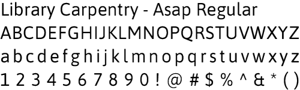

# Library Carpentry Style Guide
This style guide provides files and information useful for creating materials that are consistent with the Library Carpentry branding.

## Logo

Library Carpentry logo

Library Carpentry logo - stacked variant

The Library Carpentry logo was designed by Tammy Nguyen.

## Font

The logo uses the [Asap font](http://www.omnibus-type.com/fonts/asap/), designed by Pablo Cosgaya for [Omnibus-Type](http://www.omnibus-type.com) and distributed under the [SIL Open Font License](http://scripts.sil.org/OFL)

## Colors

